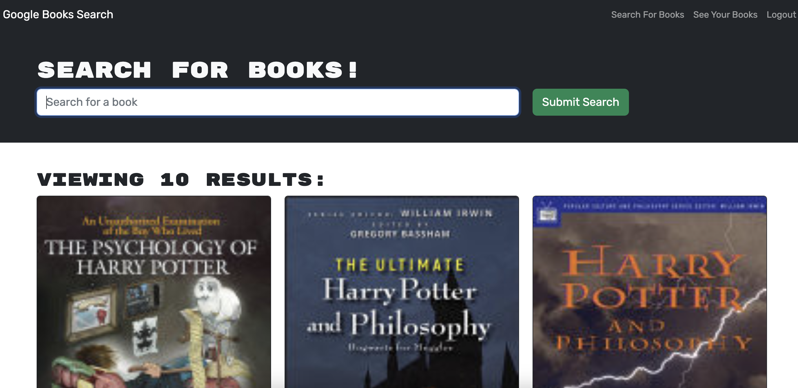

# Google Book Management System



This repository contains the code for a book management system built with the MERN (MongoDB, Express, React, Node.js) stack. It allows users to search for books using Google's APIs as well as to add books to their list. It implements authentication so that users can sign-up and login in from any device to see their saved books.

[Deployed URL](https://book-catalog-mern.herokuapp.com/)

## Table of Contents

[Getting Started](#Getting_Started)

[Usage](#Usage)

[Questions](#Questions)

<hr>

## Getting Started

To get started with this project, first clone the repository and install the dependencies:

```
git clone https://github.com/alflint/book-mern
cd book-mern
npm install
```

Next, create a `.env` file in the `server/` directory of the project and add your MongoDB connection string:

```
MONGODB_CONN_STR=<your-mongodb-connection-string>
PORT=3000
NODE_ENV=<env>
```


Finally, start the server && client in the root directory:

```
npm run develop
```


The server should now be running at `http://localhost:3000`.

## Usage
The application should now be up and running. Feel free to search for books using the search bar. If you'd like to create an account, click __Login/Sign Up__ in the top right corner. Once logged in you can save books to your collection. If you wish to remove a saved book, in the top right corner click __See Your Books__. From there you will see all your previously saved books as well as the option to remove them from your collection.


## Questions

If you have any questions feel free to [email me](mailto:alexandreaflint1111@gmail.com) or reach out on [Github](https://github.com/alflint11)